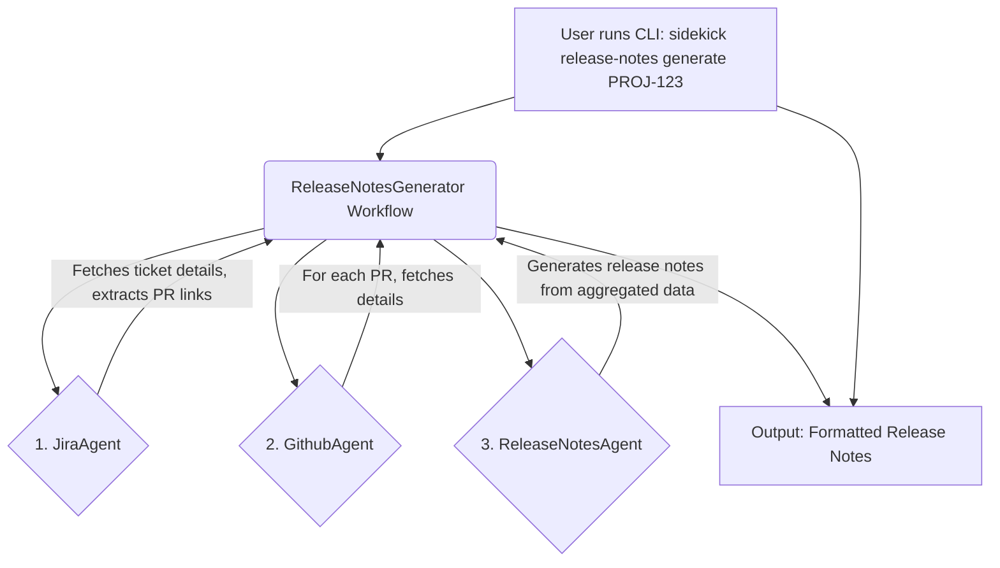

# Plan: Release Notes Generation Agent

This document outlines the plan to create a new `release-notes` agent in the `sidekick` CLI application. The agent will be orchestrated by a workflow that generates release notes from a given Jira ticket ID.

## 1. Goal

The primary goal is to build a CLI command `sidekick release-notes generate <JIRA_TICKET_ID>` that automates the creation of release notes by fetching information from Jira and associated GitHub pull requests.

## 2. Key Documentation & Examples

This implementation will be guided by the official Agno documentation and existing patterns within this codebase.

-   **Agno Documentation:**
    -   **Jira Tools:** [https://docs.agno.com/tools/toolkits/others/jira](https://docs.agno.com/tools/toolkits/others/jira)
    -   **GitHub Tools:** [https://docs.agno.com/tools/toolkits/others/github](https://docs.agno.com/tools/toolkits/others/github)
    -   **Workflows:** [https://docs.agno.com/workflows/introduction](https://docs.agno.com/workflows/introduction)
-   **Internal Code Examples:**
    -   **Agent Implementation:** `src/sidekick/agents/search_agent.py` serves as a reference for creating new agents.
    -   **CLI Command Structure:** `src/sidekick/cli/app.py` provides the pattern for adding new Typer sub-applications.
-   **POC Implementation Reference:**
    -   **Complete POC:** `release-notes-generator/` folder contains a working proof-of-concept implementation that demonstrates the core functionality.
    -   **Key POC Files:**
        -   `release-notes-generator/main.py` - Main orchestration logic
        -   `release-notes-generator/JiraClient.py` - Jira API integration with issue processing
        -   `release-notes-generator/GitHubClient.py` - GitHub API integration for PR details
        -   `release-notes-generator/LLMClient.py` - LLM integration for content generation
        -   `release-notes-generator/prompt.py` - System prompt construction with examples
        -   `release-notes-generator/examples.json` - Training examples for the LLM

## 3. Architecture

The system will use a workflow-centric design, orchestrating three distinct, reusable agents to handle specific tasks. This promotes modularity and separation of concerns.

### Component Breakdown:

1.  **`JiraAgent` (`src/sidekick/agents/jira_agent.py`)**
    -   **Purpose:** A generic, reusable agent for all interactions with Jira.
    -   **Tools:** `agno.tools.jira.JiraTools`.
    -   **Function:** Accepts a Jira ticket ID and returns structured data, including ticket summary, description, and any GitHub PR URLs found in the ticket's content.
    -   **POC Reference:** See `release-notes-generator/JiraClient.py` for implementation patterns, particularly the `JiraIssue` class and `_process_issue` method.

2.  **`GithubAgent` (`src/sidekick/agents/github_agent.py`)**
    -   **Purpose:** A generic, reusable agent for all interactions with GitHub.
    -   **Tools:** `agno.tools.github.GithubTools`.
    -   **Function:** Accepts a GitHub repository URL and pull request number, returning structured data about the PR (title, body, changed files).
    -   **POC Reference:** See `release-notes-generator/GitHubClient.py` for PR URL parsing and API integration patterns.

3.  **`ReleaseNotesAgent` (`src/sidekick/agents/release_notes_agent.py`)**
    -   **Purpose:** A specialized writer agent responsible for content generation.
    -   **Tools:** None.
    -   **Function:** Takes the structured data aggregated from the `JiraAgent` and `GithubAgent` and synthesizes it into a well-formatted, human-readable release note.
    -   **POC Reference:** See `release-notes-generator/LLMClient.py` and `release-notes-generator/prompt.py` for prompt construction and LLM integration patterns.

4.  **`ReleaseNotesGenerator` Workflow (`src/sidekick/workflows/release_notes.py`)**
    -   **Purpose:** The central orchestrator of the entire process.
    -   **Logic:**
        1.  Receives the Jira ticket ID.
        2.  Invokes `JiraAgent` to get ticket data and PR links.
        3.  Loops through PR links, invoking `GithubAgent` for each to get PR details.
        4.  Aggregates all the collected data.
        5.  Invokes `ReleaseNotesAgent` with the complete data to generate the final text.
        6.  Returns the generated release notes.
    -   **State:** The workflow will be configured to be stateful, enabling persistence and caching using `session_id` and `user_id`.
    -   **POC Reference:** See `release-notes-generator/main.py` for the main orchestration logic in the `generate_release_notes` function.

5.  **CLI Command (`src/sidekick/cli/release_notes.py`)**
    -   **Purpose:** Provides the user interface for the feature.
    -   **Framework:** Typer sub-application.
    -   **Function:** The `generate` command will parse the Jira ticket ID, initialize and run the `ReleaseNotesGenerator` workflow, and print the final output to the console.
    -   **POC Reference:** See `release-notes-generator/main.py` for argument parsing and CLI structure patterns.

## 4. Implementation Hints from POC

### Data Models
- **JiraIssue Class:** The POC defines a `JiraIssue` class with fields for `key`, `summary`, `description`, `components`, and `pr`. Consider creating similar Pydantic models for structured data exchange between agents.
- **PR Class:** The POC has a `PR` class with `url`, `description`, and `changeset` fields. This pattern can be adapted for the GitHub agent's output.

### API Integration Patterns
- **Jira Integration:** The POC uses the `jira` library directly. The Agno `JiraTools` will provide similar functionality but with a more standardized interface.
- **GitHub Integration:** The POC manually parses PR URLs and makes REST API calls. The Agno `GithubTools` will handle this more elegantly.
- **Error Handling:** The POC includes basic error handling for API calls. Ensure similar patterns are implemented in the agents.

### Content Generation
- **Prompt Engineering:** The POC uses a sophisticated prompt system with examples from `examples.json`. The `ReleaseNotesAgent` should use a similar approach with a well-structured system prompt.
- **Example-Driven Learning:** The POC includes training examples that show input/output pairs. Consider embedding similar examples in the agent's instructions.
- **Structured Output:** The POC generates release notes with specific formatting (e.g., "= Title" followed by descriptive text). The agent should follow similar conventions.

### Workflow Orchestration
- **Data Flow:** The POC processes issues sequentially, fetching Jira data first, then GitHub data, then generating content. The workflow should follow a similar pattern.
- **State Management:** The POC doesn't persist state, but the workflow should use Agno's session management for caching and persistence.

## 5. File-by-File Implementation Plan

| File                                                | Action      | Description                                                                                                                              |
| --------------------------------------------------- | ----------- | ---------------------------------------------------------------------------------------------------------------------------------------- |
| `docs/plans/release-notes-agent.md`                 | Create      | This planning document.                                                                                                                  |
| `pyproject.toml`                                    | Modify      | Add `jira` and `pygithub` to the `[project.dependencies]` section.                                                                        |
| `src/sidekick/agents/jira_agent.py`                 | **Create**  | Define the generic `JiraAgent` class equipped with `JiraTools`.                                                                            |
| `src/sidekick/agents/github_agent.py`               | **Create**  | Define the generic `GithubAgent` class equipped with `GithubTools`.                                                                        |
| `src/sidekick/agents/release_notes_agent.py`        | **Create**  | Define the `ReleaseNotesAgent` for synthesizing the final text.                                                                            |
| `src/sidekick/workflows/__init__.py`                | **Create**  | Create an empty `__init__.py` file to make the `workflows` directory a Python package.                                                   |
| `src/sidekick/workflows/release_notes.py`           | **Create**  | Define the `ReleaseNotesGenerator` workflow class to orchestrate the agents.                                                             |
| `src/sidekick/cli/release_notes.py`                 | **Create**  | Define the `release-notes` Typer sub-application with the `generate` command.                                                              |
| `src/sidekick/cli/app.py`                           | **Modify**  | Import and register the new `release_notes_app` with the main `app`.                                                                     |

## 6. Testing Strategy

As per the user's request, no automated unit or integration tests will be written. The feature will be validated manually by running the `sidekick release-notes generate` command with a sample Jira ticket ID and verifying that the output is correct and well-formatted.

## 7. Environment Setup

The implementation will require the following environment variables (similar to the POC):
- `JIRA_SERVER_URL` - The Jira server URL
- `JIRA_USERNAME` - Jira username for authentication
- `JIRA_TOKEN` - Jira API token for authentication
- `GITHUB_ACCESS_TOKEN` - GitHub personal access token

These should be documented in the CLI help and README files.
